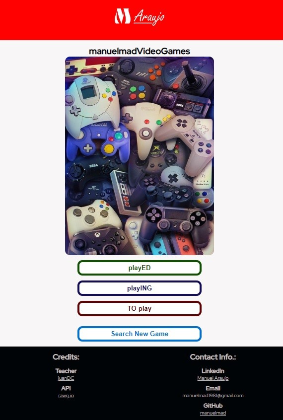

# API-REST
## Aplicación para llevar control de los videojuegos jugados, en progreso y por jugar.

Esta aplicación fue construida consumiendo la API de [rawg.io](https://rawg.io/), con un solo archivo HTML.

La vista principal o home cuenta con 3 botones para acceder a las vistas de cualquiera de las listas de juegos antes mencionadas, llamadas: playED, playING y TOplay. Además, hay un cuarto botón que nos lleva a una vista de búsqueda de juegos, Search New Game.

Hice una pequeña base de datos inicial dentro de JavaScript para que las listas muestren algunos juegos por defecto. Creé 3 arrays que contienen juegos de Sonic (jugados, jugando y por jugar), 35 juegos en total sumando las 3 listas.

Las imágenes disponibles para la mayoría de los juegos no son de mi agrado, por ello busqué y guardé en local imágenes de los juegos de Sonic que sí fueran de mi gusto, para mostrar cada uno de estos 35 juegos en las vistas correspondientes.

## Descripción de la Aplicación.
### En el home
- Haciendo clic sobre el botón "playED", vamos a la vista que muestra los juegos en dicha categoría, el hash es actualizado y el color del header cambia.
- Haciendo clic sobre el botón "playING", vamos a la vista que muestra los juegos en dicha categoría, el hash es actualizado y el color del header cambia.
- Haciendo clic sobre el botón "TOplay", vamos a la vista que muestra los juegos en dicha categoría, el hash es actualizado y el color del header cambia.
- Haciendo clic sobre el botón "Search New Games", vamos a la vista donde podremos hacer una búsqueda de juegos disponibles en la base de datos de la API, el hash es actualizado y el color del header cambia.

### En playED Games:
- Cada contenedor de juego cuenta con un botón para eliminar el juego de esa lista y por ende de la vista.
- Aparecen un ícono de flecha para retroceder y uno de una casa para ir al home.
- Obtengo el nombre del juego desde la API.

### En playING Games:
- Cada contenedor de juego cuenta con 2 botones: un botón para eliminar el juego de esa lista y por ende de la vista y otro para agregarlo a la lista de playED (y sacarlo de playING al mismo tiempo).
- Aparecen también los íconos de flecha y casa.
- Obtengo el nombre del juego desde la API.

### En TOplay Games:
- Cada contenedor de juego cuenta con 2 botones: un botón para eliminar el juego de esa lista y por ende de la vista y otro para agregarlo a la lista de playING (y sacarlo de TOplay al mismo tiempo).
- Aparecen también los íconos de flecha y casa.
- Obtengo el nombre del juego desde la API.

### En Search Games:
- Por defecto, al entrar en esta vista podremos ver una lista de juegos en tendencia.
- Existe un botón con una lupa que ejecutará la búsqueda según lo que hayamos ingresado en el input y actualizará el hash.
- En cada búsqueda, se muestra una lista de 20 juegos. Se cuenta con botones para desplazarnos hacia la página anterior o posterior y así ser capaces de ver todos los juegos disponibles.
- Aparecerá un alert si el usuario intenta ir a una página posterior a la última o anterior a la primera.
- Cada contenedor de juego cuenta con 3 botones para agregar dicho juego a la lista que queramos. Si el juego ya existe en alguna de los 3 listas, se muestra un alert y se detiene la acción.
- Aparecen también los íconos de flecha y casa.

### En playED Games, playING Games, TOplay Games y Search Games:
- Haciendo clic sobre la imagen de un juego, vamos a la vista que muestra el detalle del mismo (Game Details), el hash es actualizado y el color del header cambia.

### En Game Details:
- Obtengo la imagen, el nombre, la fecha de lanzamiento, los géneros, la descripción y el puntaje de metacritic desde la API.

